# Rabbitmq

## Iniciando

- Aula 1: Introdução
    - Sobre o RabbitMQ
        - Message Broker
        - Implementa AMQP, MQTT, STOMP e HTTP
        - Desenvolvido em Erlang
        - Desacoplamento entre serviços
        - Rápido e poderoso
        - Padrão de mercado
    - Por baixo dos panos...
        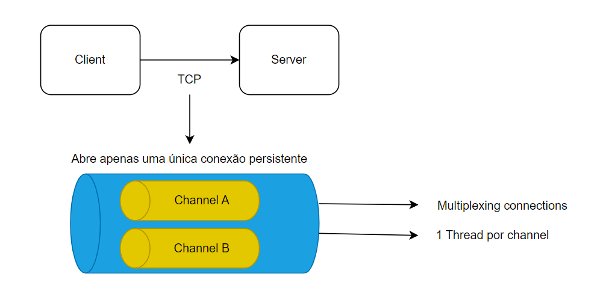
    - Funcionamento básico
        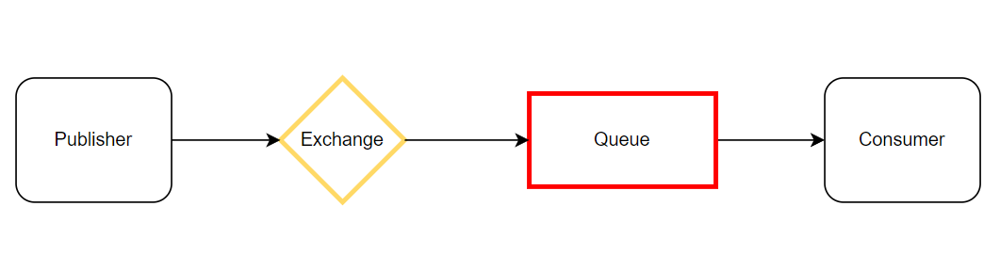
    - Tipo de Exchange
        - Direct
        - Fanout
        - Topic
        - Headers
    - Direct Exchange
        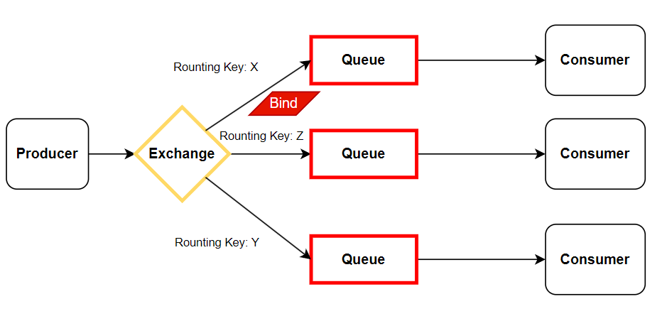
    - Fanout Exchange
        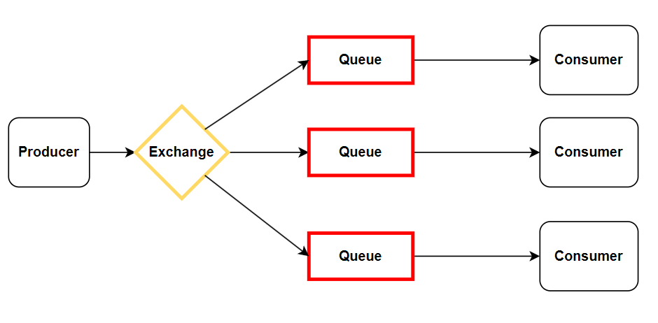
    - Topic Exchange
        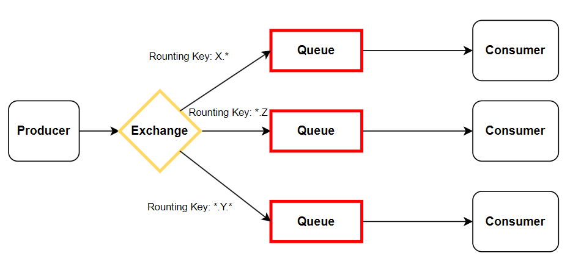
    - Queues
        - FIFO - First In, First Out
        - Propriedades
            - Durable : Se ela deve ser salva mesmo depois do restart do broker
            - Auto-delete : Removida automaticamente quando o consumer se desconecta
            - Expiry: Define o tempo que não há mensagens ou clientes consumindo
            - Message TTL : Tempo de vida da mensagem
            - Overflow
                - Drop head (remove a última)
                - Reject publish
            - Exclusive : Somente channel que criou pode acessar
            - Max length ou bytes : Quantidade de mensagens o tamanho em bytes máximo permitido
                - Caso aconteça, teremos um overflow e podemos escolher em remover as mensagens mais antigas ou rejeitar a nova
    - Dead letter queues
        - Algumas mensagens não conseguem ser entregues por qualquer motivo
        - São encaminhadas para uma Exchange específica que roteia as mensagens para uma dead letter queue
        - Tais mensagens podem ser consumidas e averiguadas posteriormente.
    - Lazy Queues
        - Mensagens são armazenadas em disco
        - Exige alto I/O
        - Quando há milhões de mensagens em uma fila, por qualquer motivo, há a possibilidade de liberar a memória, jogando especificamente as mensagens da fila em questão em disco.

## Simulador de Comportamento

- Aula 2: Simulador com Rabbitmq
    - Site <https://tryrabbitmq.com/>
    - Direct
        - 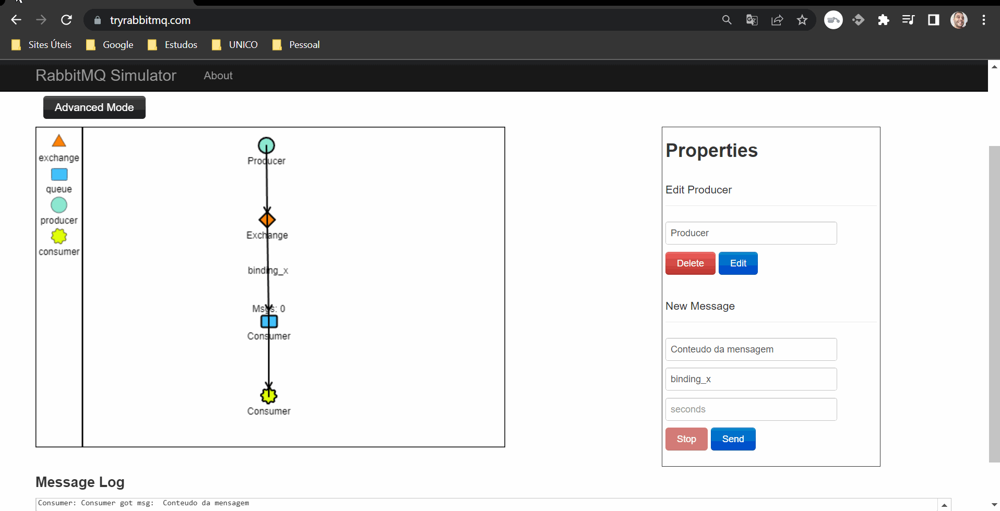
        - 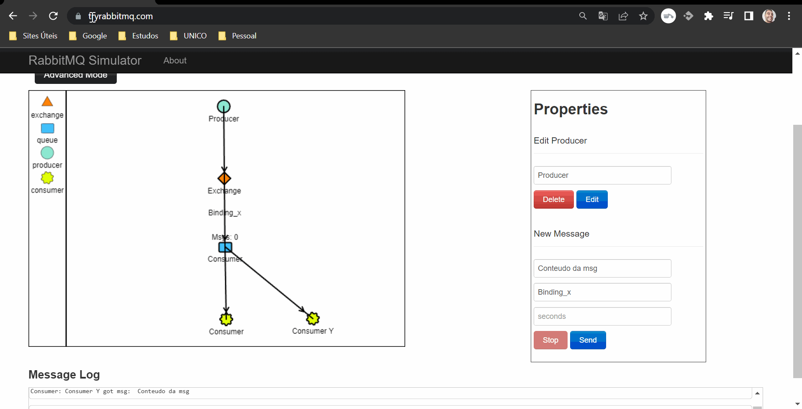
        - 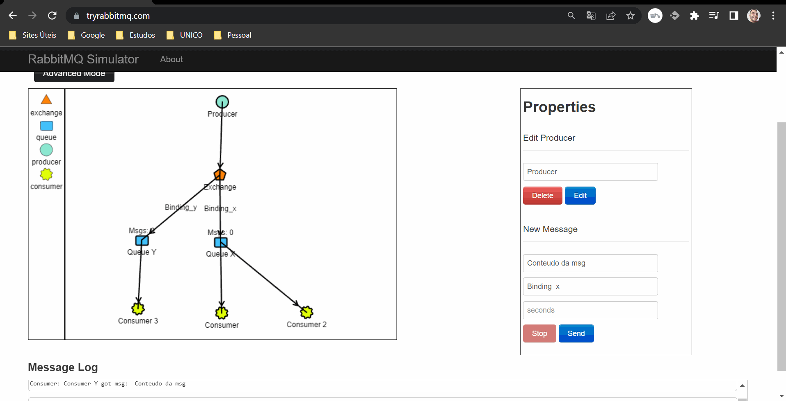
    - Fanout
        - 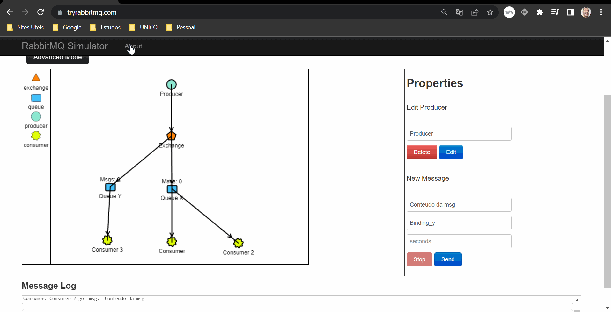
        - 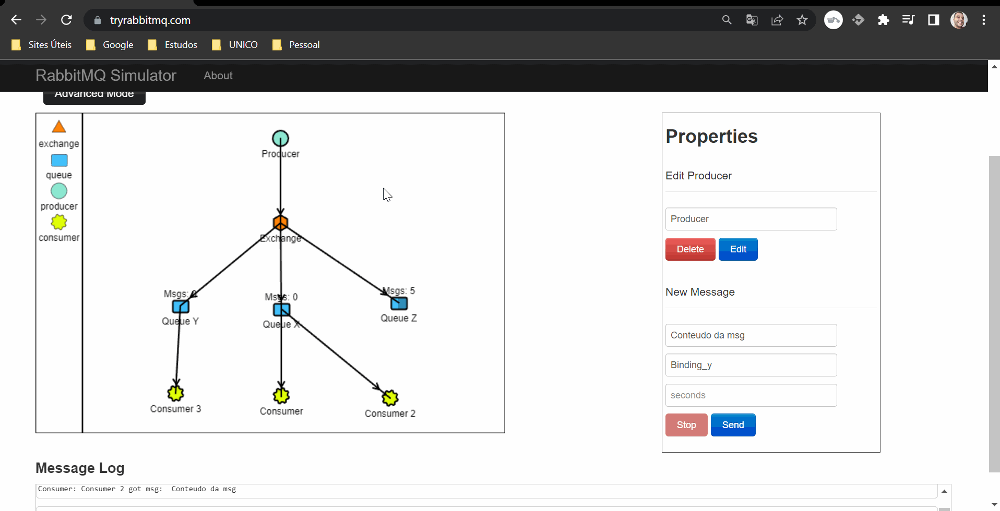
        - 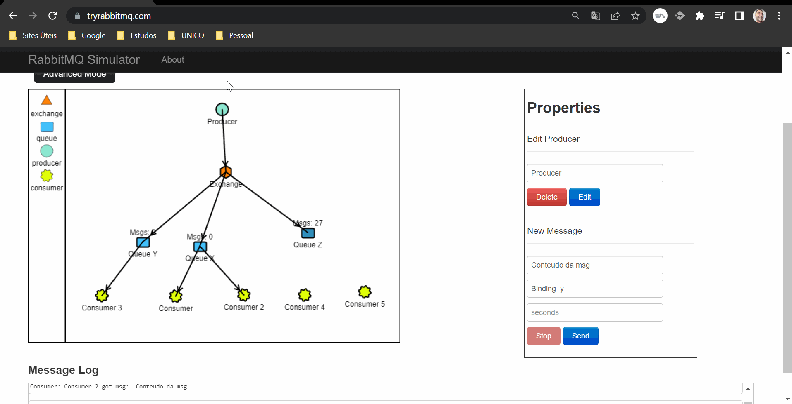
    - Topic
        - 
        - 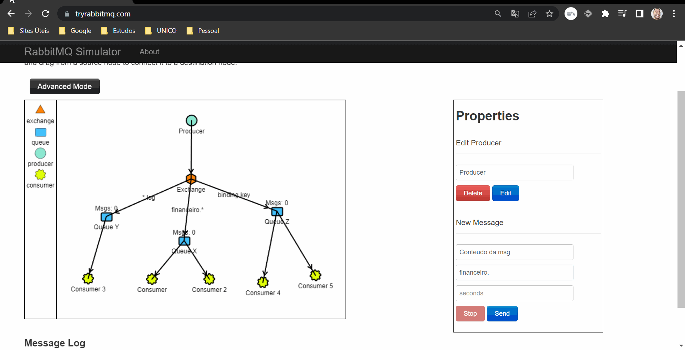

## Confiabilidade

- Aula 3: Confiabilidade
    - Como garantir que as mensagens não serão perdidas no meio do caminho?
    - Como garantir que as mensagens puderam ser processadas corretamente pelos consumidores?
    - Recursos do RabbitMQ pensados para resolver tais situações
        - Consumer acknowledgement
            - Basic.Ack
            - Basic.Reject
            - Basic.Nack
            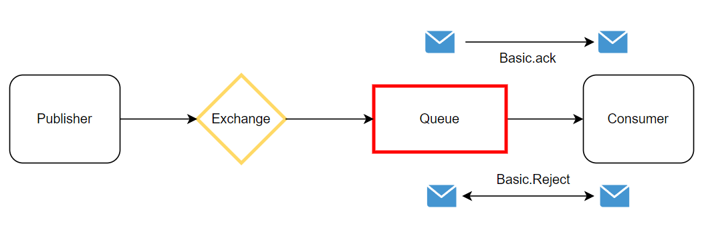
        - Publisher confirm
            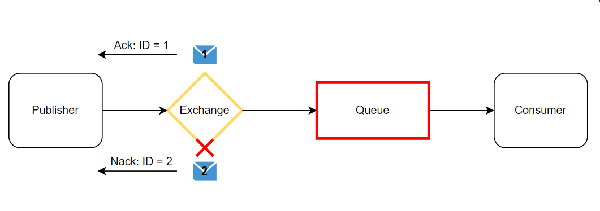
        - Filas e mensagens dúraveis / persistidas

## RabbitMQ

- Aula 4: RabbitMQUI
    - Instalando o RabbitMQUI, criando o arquivo docker-compose.yaml
    - Navegando pelo painel do RabbitMQ
    - Criando Queue
    - Binding com um Exchange